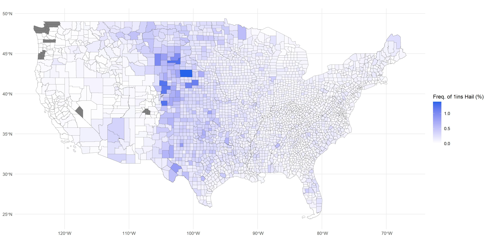
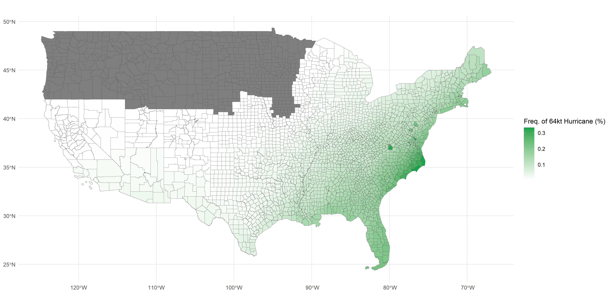

# SunRE REFI: Parametric Collateralised Insurance Options for Solar!
## Overview
SunRE REFI simulates how parametric derivatives can be used to underwrite natural catastrophe risk for the next generation of clean energy infrastructure. 
The simulator utilises portfolios of single-trigger parametric weather-derived collateralised call options to underwrite natural catastrophe risk for solar farms. 
These light-weight products provide a generic, scalable and liquid solution to the provision of energy finance and asset insurance.
By focussing on the physical element of natural catastrophe insurance, SunRE REFI is able to underwrite energy infrastructure without the need for complex and expensive engineering models, and asset-specific underwriting.
As such, SunRE REFI narrows the scope of a highly complex and technically challenging insurance underwriting problem. 
This allows the protocol to leverage highly liquid Web3 markets, emergent capital and smart contract technology, and provide a scalable solution for asset owners, insurance captives, reinsurance and mutuals alike.

## Simulator Structure and Features
The simulator takes publicly available historical weather, geography and physics data to simulate claims for any portfolio of solar farm assets across the mainland United States and Hawaii. 
These claims occur via single-variable weather triggers from a simulated data-oracle collecting data for each solar farm site.
Perils covered currently include:
- Wind/storm (payout to an insured asset when maximum daily wind speed >= 34 kt and < 64 kt)
- Wildfire (payout when a wildfire crosses into the insured asset's county)
- Hurricane (payout when >= 64 kt windspeeds of a hurricane overlaps with the insured asset)
- Hail (payout when hail swath with maximum hail stone size >= 2 ins overlaps with the insured asset)

The protocol defends it's solvency through structured pools of capital. 
These pools receive capital injections through premium and capital investment returns, and leakages through claims (when trigger conditions occur) and investment losses. 
Currently, there are two pools or _layers_ of capital.
The first, layer 1 (L1), operates as a backstop or "last line of defence" in defending the solvency of the protocol.
Commensurate with the protocol design, this fund is denominated in Ethereum, earns a staking yield and is subjected to (a historically marginal) slashing risk.
Layer 2 (L2), captive/insurance layer, directly interacts with insurance liabilities and pays claims to/receives premium directly from insured parties.
L1 is USD denominated and invests capital in a combination of US treasury bonds and a S&P500 index fund.
Effectively, L2 can thought of as a maximal loss reinsurance layer for L1, who's exposure is mediated by the amount of capital at risk (or maximal loss before insolvency) of L1.
L2 will only be called on to payout claims once L1 becomes insolvent.
Where L1 is subject to USD/ETH basis risk, the end-of-day spot exchange rate is used to move capital between the two pools.
No transaction fees of exchange or purchase/liquidation of investment assets are assumed.
For simplicity and at this initial stage, L1 transfers premium to L2 for reinsurance proportional to total protocol capital contributed.

Premium is calculated for a given portfolio of risks as the expected value of claims at the localised county for each asset and each peril (state where data is missing) with an adjustable loss ratio.
Premium is paid uniformly each day (ignores discounting and inflation).
The integration of an actuarial premium model when available would add significant value to this simulation, especially in the simulation of protocol returns.
The simulator code-base would easily incorporate the deployment of an exogenous premium model when there is one available.

The simulator has also been designed to incorporate more complete, robust and detailed natural peril datasets when available.
Currently, simulation can be run on historical weather years spanning 1955-2023.
The incorporation of more historical data or proprietary forecast data would allow for a greater depth of empirical simulation.

The goal of the simulator is to empirically test solvency and yield on capital for different portfolios of insured assets, and protocol configurations.
This is akin to Monte Carlo simulation used to construct probability distributions in complex, multi-variate probability problems; and common in short-tail insurance modelling.
The simulator operates in discrete daily time steps, with premium received and claims paid out at the end of each day after the realisation of investment returns.
Each simulation year is an intra-year time-dependent Markov Chain but inter-year independent.
Effectively, this means that claims are settled at the end of each day and the portfolio is "reset" every year (capital restored and profits taken); each year of simulation is independent of eachother.
This allows for the capturing of intra-year dependent risks but disaggregates inter-year correlations/clusters of risks.
This decision and protocol design choice aligns with the liquid and short-duration nature of Web3 financial products.
Portfolios are randomly selected subject to user input variables such as state(s), min and max solar farm AC MW size, number of assets, etc.
Selection of specific assets is easily configurable in the code-base down the road when required. 
The simulator runs _m_ portfolio iterations containing _n_ assets over _y_ historical weather years.
This creates _m_ x _n_ x _y_ datapoints of risk.

Details on protocol design, data sources, augmentations and assumptions, and US solar sites on Notion: https://www.notion.so/Refiant-Simulator-1ecdd598bdb480939e38ff1098cdc9a9

## Running the Simulator

### Requirements
The simulator is built in and requires R to run.
R and R packages are relatively robust compared to Python which typically requires specific Python and package versions to run modules.
Any R >= 4.3.3 should work with this program.

The latest R can be downloaded from: https://cloud.r-project.org/ <br>
Optional R Studio IDE: https://posit.co/downloads/

This program requires `Tidyverse`, `Geosphere` and `sf` packages to run. 
These are commented out at the top of the RUN SIMULATION.R script:
```r
install.packages("tidyverse")
install.packages("geosphere")
install.packages("sf")
```
*Packages only need to be installed the first time*

### Protocol Set Up
In RUN SIMULATION.R, `sunrefi_sim()` will call on the program to run the simulation. 
Any individual or combinations of variables is settable in the following list of arguments in `sunrefi_sim()` (default values shown):
```r
refiant_sim(seed = 100, # sets seed for random asset selection and investment returns
            iter = 20, # number of random portfolios to iterate over (m)
            wy = 1955:2023, # vector of weather years
            CAR = 0.5, # capital-adequacy-ratio, e.g. CAR = 0.2 => $0.2 of capital for every $1 of risk
            loss_ratio = 0.5, # profit target per unit of underwritten risk, how much of premium received do we expect to pay out?
            L1_ratio = 0.5, # proportion of capital in L1
            states = c("NY", "AZ"), # state(s) to draw insured assets from
            n_assets = 20, # number of insured assets in a portfolio
            sf_ac_min = 0, # minimum MW size of an insured asset
            sf_ac_max = 20, # maximum MW size of an insured asset
            fy = 2023, # financial year for treasury, S&P returns and USD/ETH (can take values/ a vector with 2021-2024 incl.)
            eth_float = 1, # USD/ETH basis risk flag, if 0 then the portfolio is basis hedged (e.g. holding USDT instead of ETH)
            R_mu = log(0.06), # L1 staking yield is drawn from LN(mu, sigma^2)
            R_sigma = sqrt(log(1+0.03^2/0.06^2)), # L1 staking yield drawn from LN(mu, sigma^2)
            S_lambda = 0.002, # L1 probability of slashing drawn from Pois(lambda)
            G_alpha = 2, # L1 size of a slash drawn from Beta(alpha, beta)
            G_beta  = 5) # L1 size of a slash drawn from Beta(alpha, beta)
```

### Simulation Results
The simulator automatically generates a number of plots for results visualisation.
These are call-able and save-able in the RUN SIMULATION.R script:
```r
plt_example # daily time series of 1 iteration-year

# protocol yield
plt_returns # monte carlo distribution of L1 and L2 yields
plt_returns_year + ylim(-100, 100) # distribution of L1 and L2 yields by weather year

plt_insolvency # monte carl distribution of L1 and L2 solvency
plt_insolvency_year # distribution of insolvency by weather year
plt_insolvency_sdi # protocol insolvency by geographic portfolio diversification

plt_claims # distribution of number of yearly claims
plt_claims_year # distribution of claims by weather year
plt_peril_year # distribution of fire, hail, hurricane and wind claims by weather year
```
Results are also directly accessible in the `output` file.
Each contains a single iteration year with L1 and L2 returns, solvency flags (i.e. did the pool go insolvent at any time in the year), number of claims, total premium and SDI.

## Example Results and Interpretation
The following results are from a 100-iteration simulation, with default parameters.
Notably, these are combinations of 20 asset portfolios in the state of New York and Arizona run over all weather years 1955-2023.
The protocol assumes half of the capital is held in L2 (USD), receives a yield from a treasury and the S&P, and the other half is held in L1 (ETH) which receives yield from staking.
Capital adequacy ratio is 0.5, we hold 50c of capital for every $1 of notional bond value we sell.

 <br>
In this year, three claims occur is close succession, resulting in L2 being liquidated and maximal loss reinsurance through L1 being triggered. 

 <br>
Yearly iteration-year returns are varied with some years very profitable (many multiple years with returns >50%) and others making significant losses.
As premium is set to the entire multi-year weather series for each porfolio, the degree of spread here indicates how correlated risks are and how diversified the portfolio is.
A high variance in annual returns is unsurprising given the portfolios are not well diversified by construction, with all 20 assets located in only two states.

 <br>
This plot tells how financial performance for a given weather year varies across portfolio iterations.
We observe low variance in any given year's outcomes - high yielding years remain high yielding regardless of the portfolio composition and vice versa for loss-making years.
This suggests that assets are not well diversified across states, compared to larger multi-state portfolios.

 <br>
The x-axis here tells us the percentage of solvent weather years for each portfolio. 
The y-axis gives us a count of portfolios at each level of aggregate solvency.
Generally, the protocol does well here, likely owing to it's strong capital adequacy (`CAR = 0.5`).
In the worst portfolio L1 is solvent in 90% of weather years.
L2, the probable maximum loss reinsurance layer, is solvent 100% of the time.

 <br>
Pivoting the solvency data this way, we can see which weather years consistently perform poorly across portfolio combinations.
2020, for example, triggers probable maximum loss reinsurance in more than 60% of portfolios.
Four years are consistently triggering reinsurance more than 50% of the time.

 <br>
`SDI` is a simple metric that informs diversity across distance for assets in the portfolio.
We observe that lower values of `SDI`, which signals lower geographic correlation, tend to rely more heavily on reinsurance.

 <br>
The maximum number of claims in a year is just over 30 from 20 insured assets.
Approximately 40% of years experience no claims.
This lumpy claims distribution underpins lumpiness in portfolio returns observed above.

 <br>
The number of claims in a given weather year is well correlated across portfolios, generally with bad years remaining bad and good years (or even no claim years) remaining this away across portfolios.

 <br>
This plot looks at the occurance of claims by weather year for each peril class.

## How does the simulator work?
Each portfolio iteration undergoes the following steps:
1. Randomly sample a portfolio of `n_assets` solar firms from _state_, between `sf_ac_min` and `sf_ac_max_ MW`.
```r
sim_sf <- solar_lookup %>% 
  filter(p_state %in% states &
           p_cap_ac >= sf_ac_min & p_cap_ac <= sf_ac_max) %>% 
  .$case_id %>% 
  sample(size = n_assets, replace = FALSE)
```

2. Find all natural peril trigger events for the sampled portfolio across the entire weather year series `wy`. See example for hail:
```r
# filter hail events that triggers a payout
hail <- hail_swaths %>% 
  # trigger on hail size 2ins
  filter(MAGNITUDE >= 2) %>% 
  st_transform(crs = 3857) %>% 
  mutate(geometry = st_buffer(geometry, dist = 10000)) # add 10km buffer to hail swaths

# find spatial overlap with assets
hail_events <- st_intersects(solar_sf, hail, sparse = TRUE)
```
3. Aggregate premium rate across peril classes and assets
```math
P_{peril, asset} = \frac{1}{t}\sum_{t}\text{I}(event_{peril, county}),
```
```math
P = \sum_{peril}\sum_{asset}P_{peril, asset}
```
            where $t$ is the total number of days across all weather years.

4. Calculate L1 and L2 yield
```r
… mutate(R = rlnorm(nrow(.), meanlog = R_mu, sdlog = R_sigma), # L1 staking yield
         S = rpois(nrow(.), S_lambda), # L1 capital slashed
         G = rbeta(nrow(.), G_alpha, G_beta), # proportion of L1 capital slashed
         Y = R/365 - S * G, # realised L1 staking yield
         eta = runif(nrow(.), 0, 1), # proportion of L2 held as treasury bonds
         I = eta * rf_ret + (1 - eta) * sp500_ret) # L2 investment yield
```

5. Calculate standardised diversity index (SDI)
```math
SDI = \frac{(\sum_{asset} D(x_i, x_j))^2}{\sum_{asset} D(x_i, x_j)^2} \times \text{E[}D(x_i, x_j)\text{]}
```
            where $D$ is the Harverstine Distance between two assets, $i, j$.

6. Calculate total notional value of bonds and capital requirements

            We assume we issue a $1 notional (single-trigger) bond per peril per asset.
            Therefore, the total notional value of porfolio risk per year is number of bonds issued.
            We only issue bonds for an asset for well defined peril risks.
            A premium rate of 0 for an asset indicates the risk is undefined and no bond is issued.
```math
\text{Total Bonds} = \sum_{asset}\sum_{peril}\text{I}(P_{asset, peril} > 0)
```
            Capital is held against the total notional value of portfolio risk (total number of $1 bonds). 
            Capital is then split across L1 and L2 layers with `L1_ratio`.
```math
\text{Capital} = \text{Total Bonds} \times \text{Capital Adequacy Ratio}
```

7. Loop through portfolio settlement with daily premium collected, investment returns realised and claims paid out for each _day_
```r
for (i in 1:nrow(j_simulation)) {
        
        L2[i+1] = L2[i] * (1 + j_simulation$I[i]) + j_simulation$P[i] * (1 - alpha) - j_simulation$claims[i]
        L1[i+1] = L1[i] * (1 + j_simulation$Y[i]) + 
          j_simulation$P[i] * alpha * (I(eth_float == 1)*j_simulation$eth_usd[1] / j_simulation$eth_usd[i] + I(eth_float == 0)*1)  + 
          min(L2[i+1], 0) * ((j_simulation$eth_usd[1]/j_simulation$eth_usd[i] - 1) * I(eth_float == 1)*1 + 1)
        
        L2_insolvency[i+1] = I(L2[i+1] < 0)*1
        L2[i+1] = (1 - L2_insolvency[i+1]) * L2[i+1] + L2_insolvency[i+1] * 0
        
        L1_insolvency[i+1] = I(L1[i+1] < 0)*1
      }
```

8. Loop 6. and 7. for each _year_ in `wy`

This simulation is repeated for each portfolio iteration in `iter`.

## Appendix
### Premium Rates
Premium rates are calculated on a per county basis by peril and mapped to each solar asset prior to the simulation.
Where county data is lacking, premium rate will be assigned to the state average.
Premium rate is calculated for different hail and wind triggers, which are adjustable in the simulation scripts:
- Hail: 1", 1.5", 2" and 2.5" triggers
- Wind: 34kt, 40kt, 45kt, 50kt, 60kt and 64kt triggers

Premium rates are merged on a per asset basis to the solar farm asset lookup table and accessible as a `.csv` in `./premium/`.

 <br>
 <br>
 <br>
 <br>
